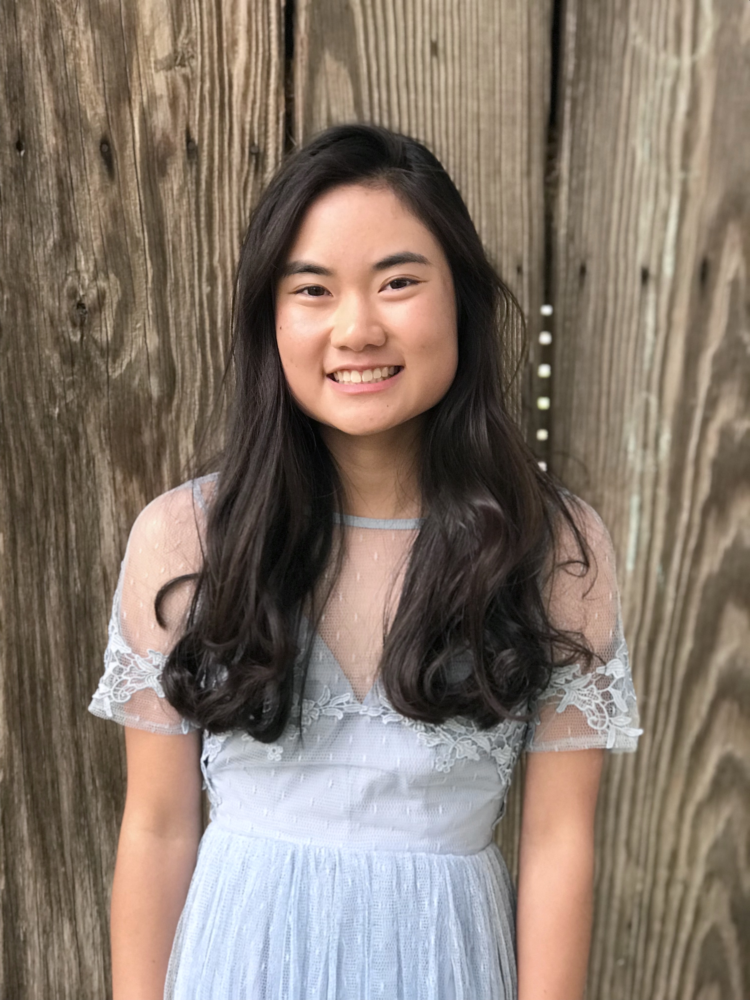

# **Welcome to Sydney Wong's Page**



## ***Bio***

Hello all! My name is Sydney, and I am a second-year computer science major at University of California, San Diego.

I am highly interested in pursuing a career in software development. You can find my resume [here](https://drive.google.com/file/d/1BpnG5C7_7QAoL8954PnyX6tcK1RgSCBy/view?usp=sharing).

## ***Interests***

###### ***Reading*** :books:

I love to read in my free time! Some of my favorite books are:
- *[Beartown](https://www.amazon.com/Beartown-Novel-Fredrik-Backman/dp/1501160761)* by Fredrik Backman
- *11/22/63* by Stephen King
- *Jellicoe Road* by Melina Marchetta

***One of my favorite quotes from _Jellicoe Road_***:
> If I want more, I need to go and get it, demand it, take hold of it with all my might, and do the best I can with it.

###### ***Tennis*** :tennis:

I played tennis in high school, and I still love to play with my friends today. My favorite tennis players (ranked) are:

1. Roger Federer
2. Bjorn Borg
3. Martina Navratilova
4. ~~Rafael Nadal~~


[link to Roger Federer image](images/rf.JPG)

## Website Improvements Checklist
- [x] add headshot
- [x] link resume
- [ ] create a custom domain
- [ ] changing some of the formatting

## Lab 1 Takeaways

I used these Git commands in the terminal:
```
git clone
git branch
git checkout
git add
git commit
git push
```

I also reviewed the following information about:
1. VSCode
   - has many features
     - VSCode extensions
     - VSCode source control UI

@sydneywong What improvements should be made to this user page? Also, please look at the branch \*add-read-me\*.

